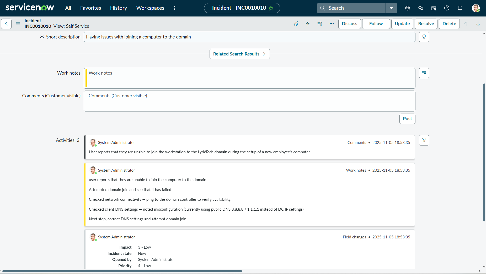
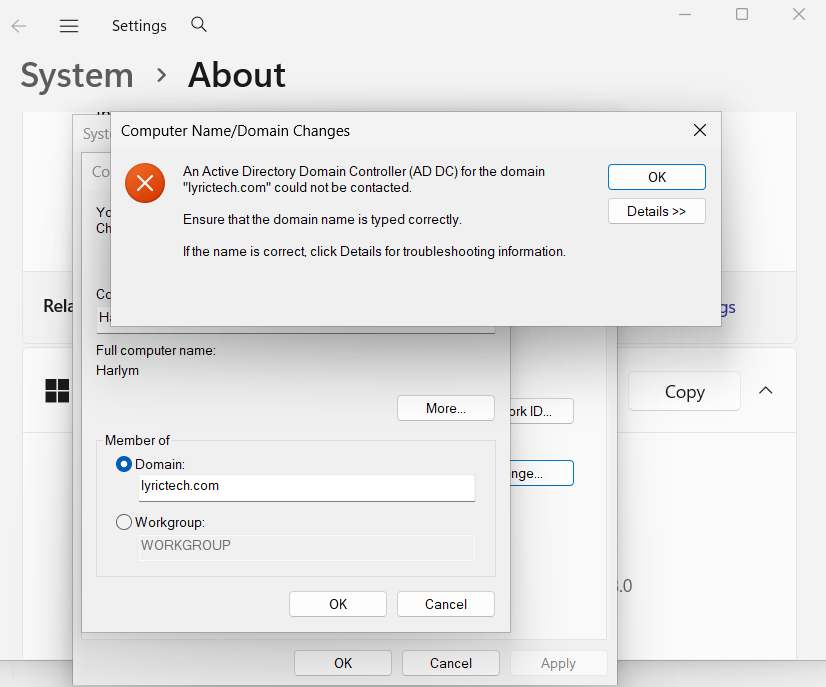
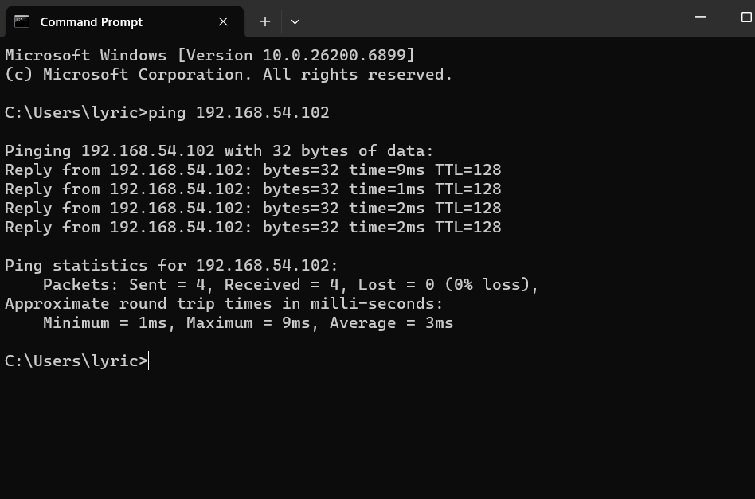
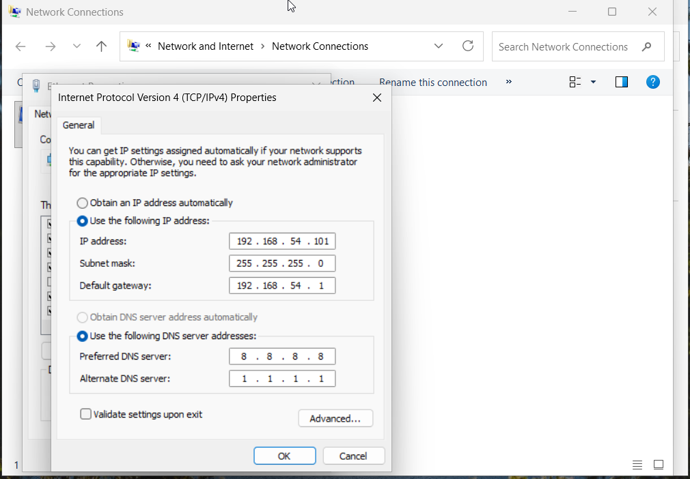
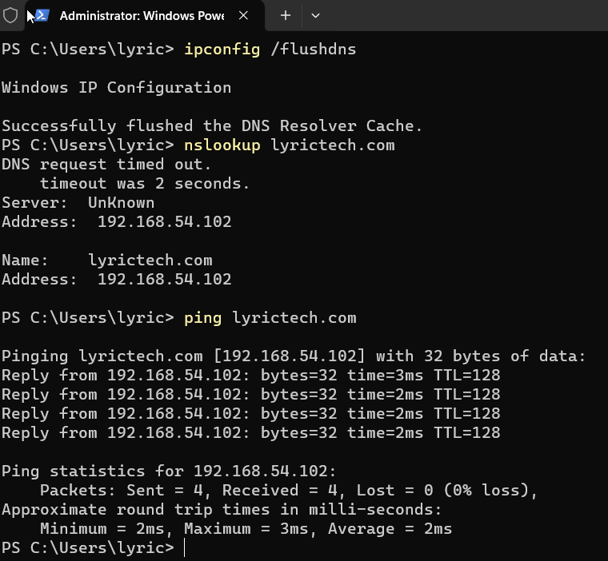

# Ticket One: Unable to Join Computer to Domain

## Issue Description
The user was unable to join a computer to the domain.

## Steps Taken
1. Ticket creation:
   
   
   *Screenshot showing the ticket being created in the Servicenow ticketing system.*

   2. Attempted domain join:
      
   
   *Screenshot showing the error message when trying to join the domain.*

   3. Ping Server Test:
   
   *Screenshot showing the first troubleshooting step: successfully pinging the server to verify network connectivity.*

4. Identify DNS Issue:
   
   *Screenshot showing the second troubleshooting step: identifying that the DNS IP address was incorrect.*

6. Ping DNS Server:
   
   *Screenshot showing that after correcting the DNS IP to the internal DNS server, the computer successfully resolved the Domain name.*

