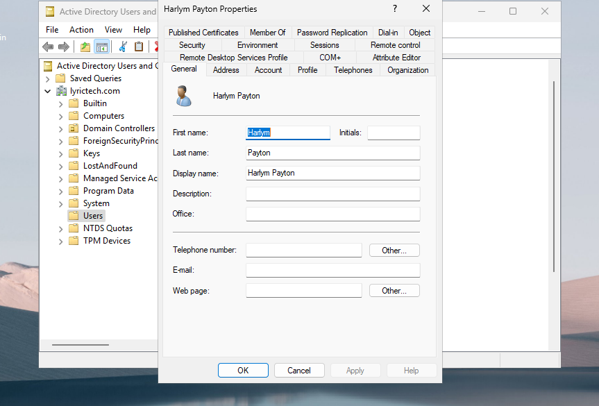
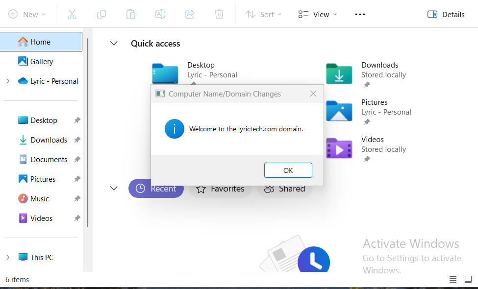
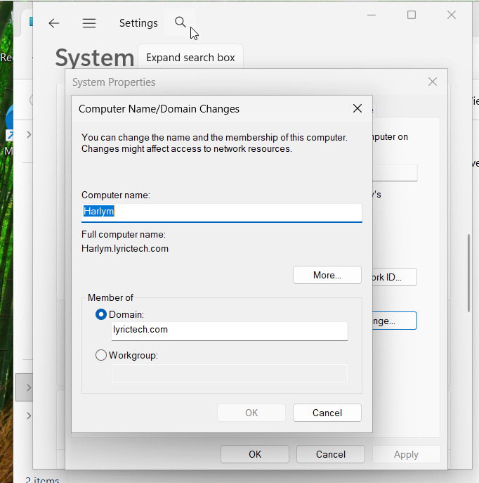
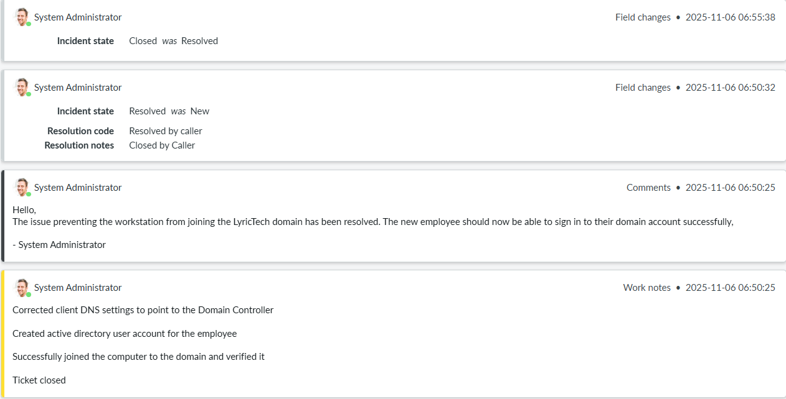

# Ticket One: Unable to Join Computer to Domain

## Issue Description
The user was unable to join a computer to the domain.

## Steps Taken
  1. Ticket creation:
   
   
   *Screenshot showing the ticket being created in the Servicenow ticketing system.*

   2. Attempted domain join:
      
   
   
   *Screenshot showing the error message when trying to join the client to the domain.*

   3. Ping Server Test:
      
   
   *Screenshot showing the client successfully pinging the server to verify network connectivity.*

   4. Identify DNS Issue:
      
   
   *Screenshot identifying that the DNS IP address was incorrect. Preferred DNS Address needed to be changed to the internal DNS server IP (Domain Controller)*

   5. Ping DNS Server:
      
   

   *Screenshot showing that after correcting the DNS IP to point to the internal DNS server (hosted on the DC), the computer successfully resolved the Domain name.*

   7. Create Active Directory User:
      
   
   
   *Screenshot from the server showing the step where a new Active Directory user was created for the computer.*

   9. Join Computer to Domain:
       
   
   
   *Screenshot showing that the computer successfully joined the domain. The computer name was updated from "Lyric" to "Harlym Payton" during the AD user creation.*

   10. Domain Login on Client:
       
   
   *Screenshot showing that after joining the domain, the client successfully logged into with their domain account.*

   12. Close Ticket:

   
   *Screenshot showing the final step of the process: closing the helpdesk ticket after the issue was resolved.*

   

