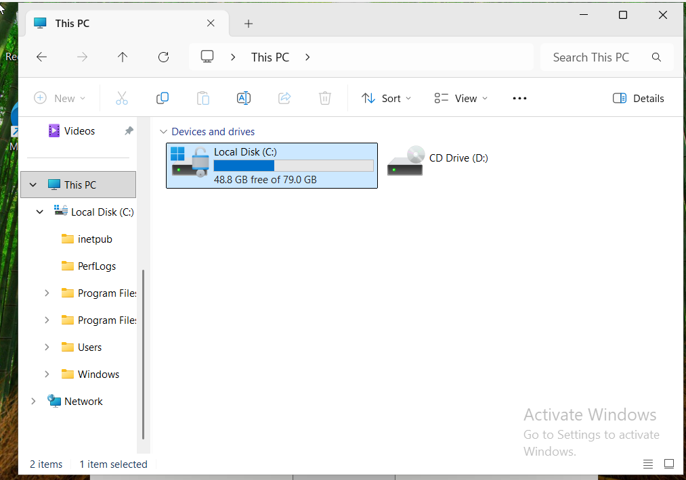

# Ticket Two: G: Drive Not Appearing in File Explorer

## Issue Description
The user reported that the G: shared drive didn't appear in the left panel in File Explorer, though they were still able to access it via the network path. 

## Steps Taken
  1. **Ticket creation:**
   
   
   *Screenshot showing the ticket being created in the Servicenow ticketing system.*

2. **G: Drive Not Viewable in File Explorer Left Panel:**
   
     
   *Screenshot showing File Explorer with the G: drive missing.*

