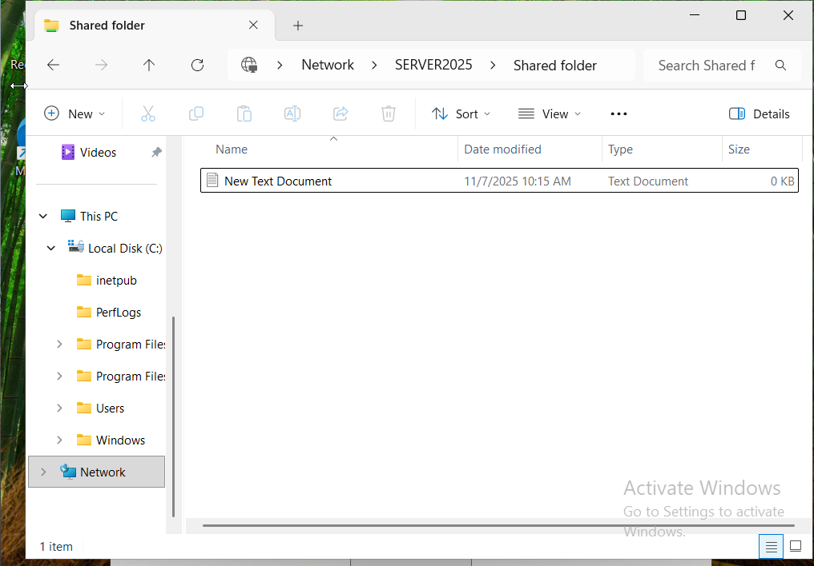
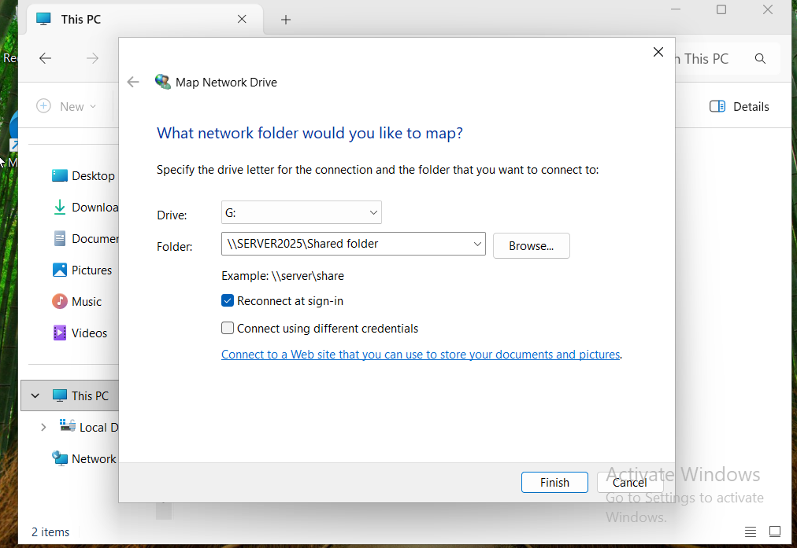
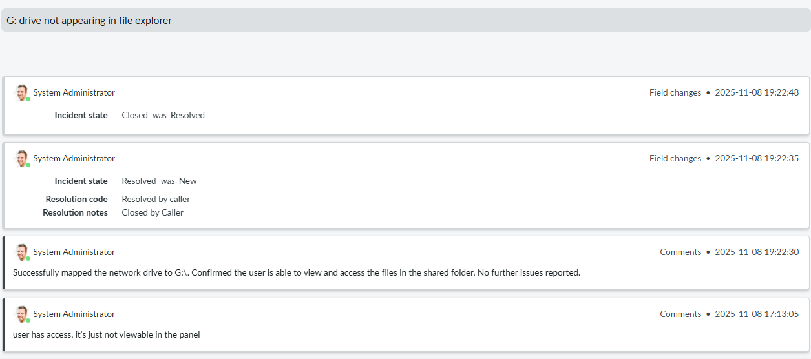

# Ticket Two: G: Drive Not Appearing in File Explorer

## Issue Description
The user reported that the G: shared drive didn't appear in the left panel in File Explorer, though they were still able to access it via the network path. 

## Steps Taken
  1. **Ticket creation:**
   
   
   *Screenshot showing the ticket being created in the Servicenow ticketing system.*

2. **G: Drive Not Viewable in File Explorer Left Panel:**
   
     
   *Screenshot showing File Explorer with the G: drive missing.*
   
3. **User Can Access G: Drive via Network Path**
      
     
   *Screenshot showing the user successfully accessing the G: drive through the network path, even though it is not visible in the left panel of File Explorer.*

4. **Map Network Drive**  
     
   *Mapped the G: shared drive on the user’s workstation using the network path.*

5. **Verify G: Drive Appears in File Explorer**
   
   
   
   *Screenshot showing that after being mapped, the G: drive now appears in the left panel of File Explorer for the user, and they have access to the files.*

   9. **Close Ticket:**

   
   *Screenshot showing the closing the helpdesk ticket is closed after the issue was resolved.*

