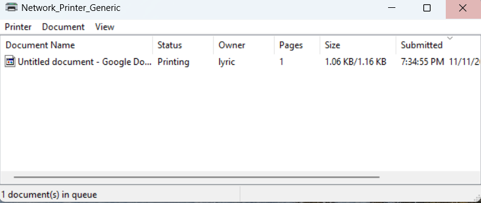
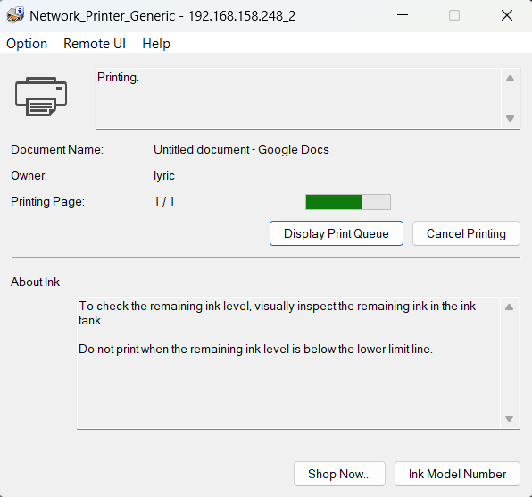

# Ticket 03 - Unable to Print - Jobs Not Reaching Printer

## Issue Description
User reports that print jobs do not start. Printer shows as "Idle" in Printers & Scanners. No error messages are displayed.

## Steps Taken

1. **Ticket Creation:**

     
   *Screenshot showing the ticket being created in the ServiceNow ticketing system.*

2. **Network_Printer_Generic in Devices List:**

     
   *Screenshot showing the printer listed in Windows Settings under Printers & Scanners with status "Idle".*

3.  **Incorrect Driver Selected (Before Change):**

     
   *Screenshot showing the printer setup with the generic driver selected.*
   
4. **Install & Select Correct Driver:**

     
   *Screenshot showing the Canon G6020 series driver being installed on the workstation.*

     
   *Screenshot showing the Canon driver being selected after installation, ready to print the document.*

 5. **Send Document & Close Ticket:**

     
   *Screenshot showing the user’s chosen document being sent to the printer and successfully processing through the print queue.*

     
   *Screenshot showing the print job completed successfully, confirming the printer is functioning with the correct driver.*

     
   *Screenshot showing the ServiceNow ticket closed after the issue was resolved.*

